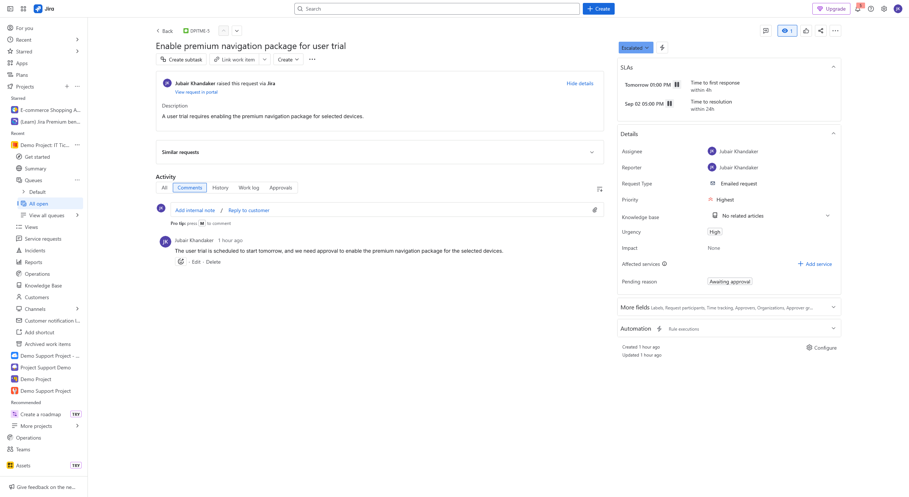
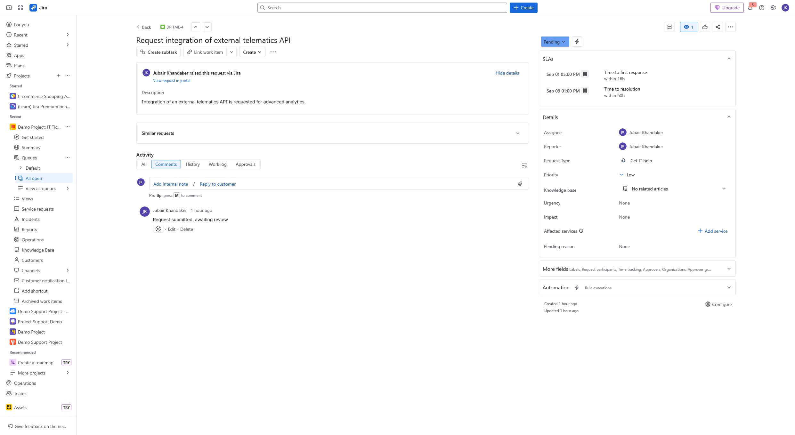

# Jira Ticketing Demo

This repository contains a demonstration of a demo project for Jira ricketing service that includes **service requests, incidents, and approval workflows**. It simulates how I would handle ticketing, prioritization, and reporting in a real IT/project support environment.

## Project Overview
- **Project Name:** eMobility Support Hub (Demo)
- **Tools Used:** Jira Software and Jira Service Management
- **Goal:** Demonstrate ticket lifecycle, workflow management, and dashboard reporting

---

## Several tickets were created under different **work types**

## Work Types
1. **Service Requests**
   - Example: *Request Laptop Upgrade for Developer*  
   - Includes **priority, due date, status tracking**, and **pending reason comments**

2. **Incidents**
   - Example: *Navigation Module Crashes Intermittently*  
   - Shows **escalation comment** and resolution workflow

3. **Service Requests with Approvals**
   - Example: *Enable Premium Navigation Package for User Trial*  
   - Demonstrates **approval step** before implementation
  
## Examples

---

## Several tickets were created under different **work types**

## Work Types
1. **Service Requests**
   - Example: *Request Laptop Upgrade for Developer*  
   - Includes **priority, due date, status tracking**, and **pending reason comments**

2. **Incidents**
   - Example: *Navigation Module Crashes Intermittently*  
   - Shows **escalation comment** and resolution workflow

3. **Service Requests with Approvals**
   - Example: *Enable Premium Navigation Package for User Trial*  
   - Demonstrates **approval step** before implementation
  
## Examples

## Queues

This section displays all the active support requests, incidents, and service requests created within the project.

Shows request type (hardware, software, IT help, admin access, etc.).

Displays current status (e.g., Pending, Escalated, Waiting for Support, Open).

Lists ticket priority and time to resolution deadlines.

Helps quickly filter tickets based on type, status, or assignee to manage workload effectively.

---

## Workflow Simulation
- **To Do → In Progress → Pending/Approval → Done**
- Tickets assigned, updated with comments, and closed after resolution
- Pending reasons (e.g., *waiting for procurement approval*) are documented in comments

---

## Dashboard
The dashboard provides real-time visibility into project support activities:
- **Pie Chart:** Tickets by type  
- **Created vs Resolved Chart:** Progress tracking  
- **Recently Updated Issues:** Active work visibility  
- **Average Resolution Time:** Efficiency metric  

---

## Example Screenshots
### Service Request

### Incident

### Request with Approval

---

## Key Takeaways
- Demonstrated handling of **service requests, incidents, and approval flows**
- Used **priorities, labels, and comments** to simulate realistic ticketing
- Built a **dashboard** for visibility and reporting
- Showcased **end-to-end ticket lifecycle**

---

## Next Steps
If you’d like, I can provide access to the **live Jira project** so you can explore the workflow and dashboard interactively.

