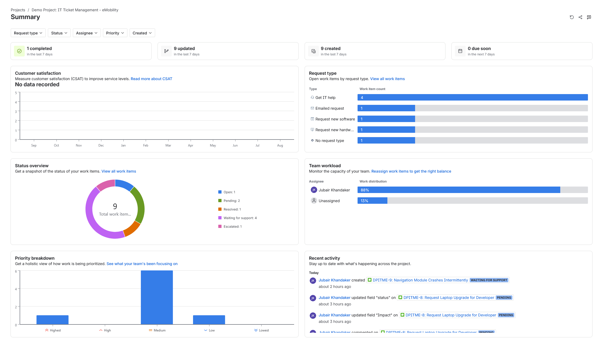
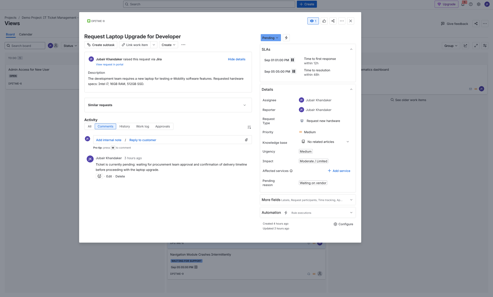
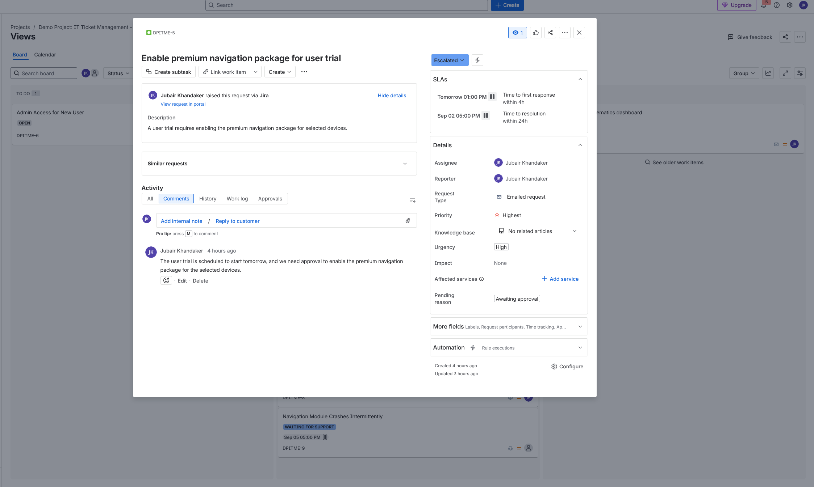
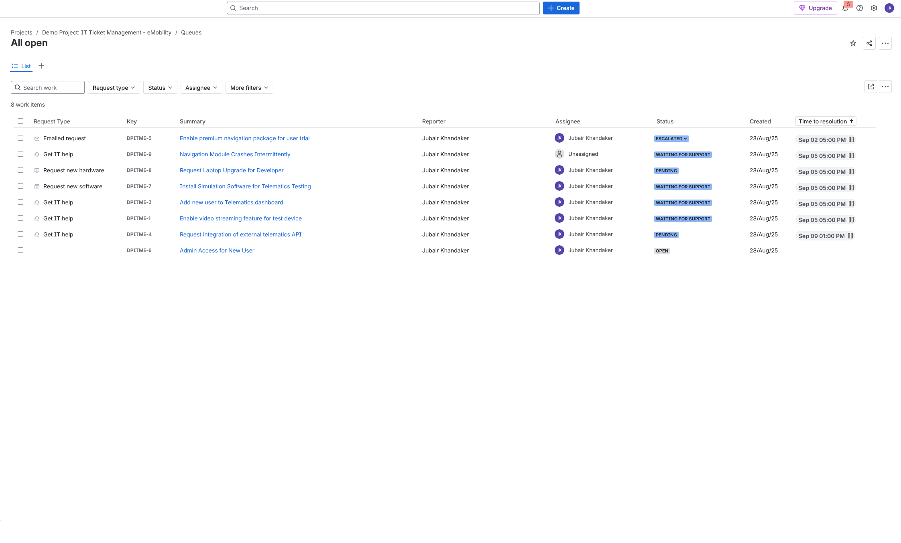
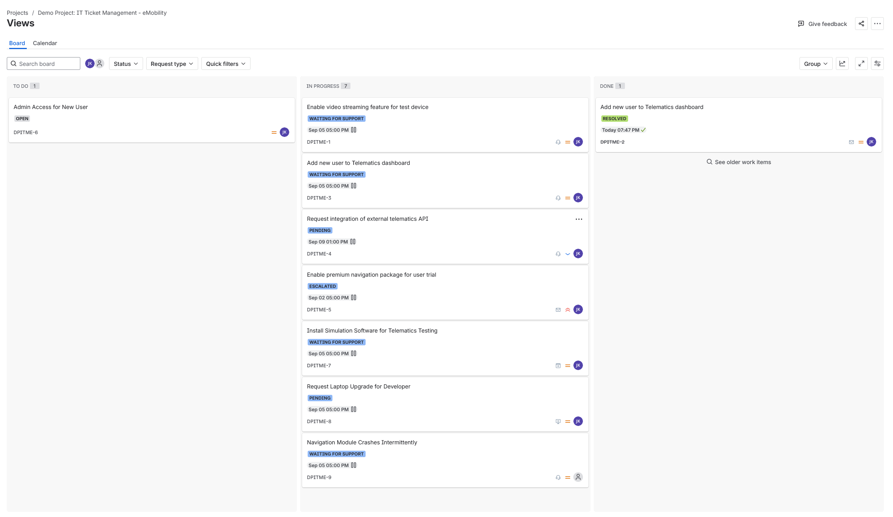
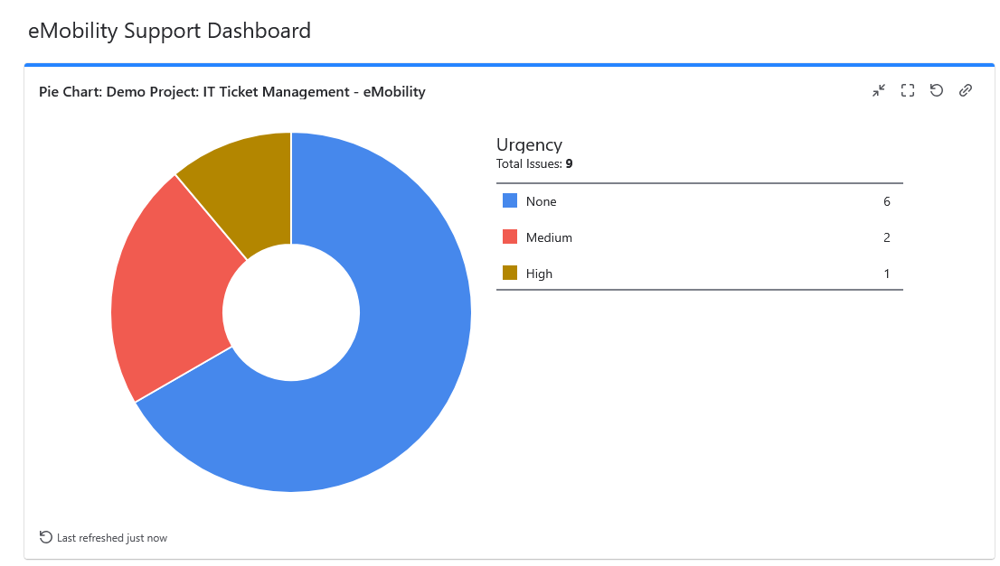
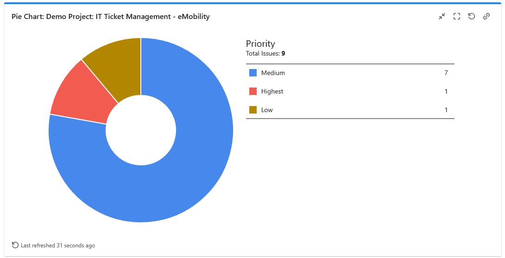
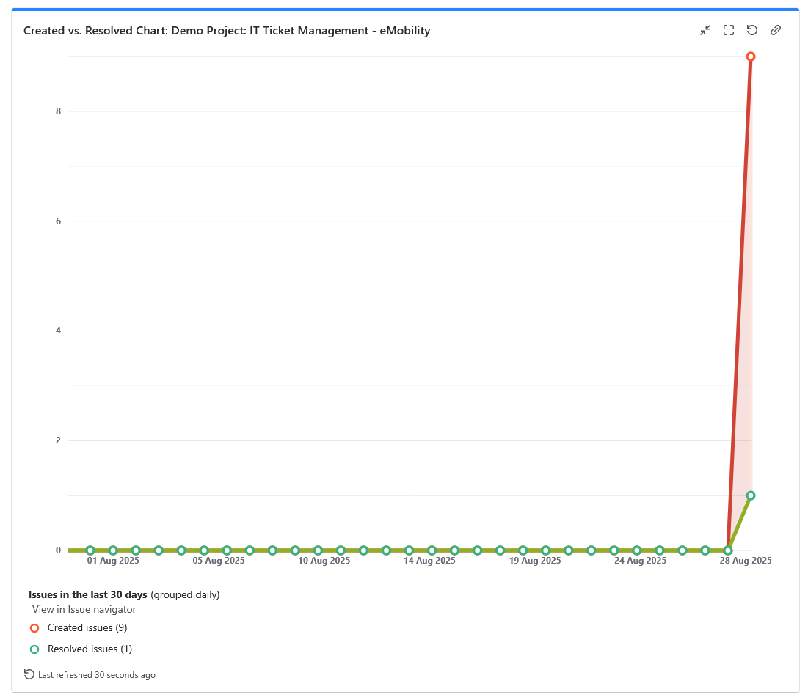

# Jira Ticketing Demo

This repository contains a demonstration of a demo project for Jira ricketing service that includes **service requests, incidents, and approval workflows**. 

## Project Overview
- **Project Name:** eMobility Support Hub (Demo)
- **Tools Used:** Jira Software and Jira Service Management
- **Goal:** Demonstrate ticket lifecycle, workflow management, and dashboard reporting

---

## Summary

- The Summary view gives an overview of all project activity at a glance.
- Request type distribution: How many tickets belong to each category (IT help, hardware, software, etc.).
- Status overview: Breakdown of tickets that are open, pending, resolved, escalated.
- Priority breakdown: How tickets are distributed across priority levels (highest, high, medium, etc.).
- Team workload: Visual representation of workload assigned to users.
- Recent activity feed: Tracks all status updates, field changes, and comments.

## Several tickets were created under different **work types**

## Work Types
1. Service Requests
2. Incidents
3. Service Requests with Approvals
  
## Examples

---

## Queues

- This section displays all the active support requests, incidents, and service requests created within the project.
- Shows request type (hardware, software, IT help, admin access, etc.).
- Displays current status (e.g., Pending, Escalated, Waiting for Support, Open).
- Lists ticket priority and time to resolution deadlines.
- Helps quickly filter tickets based on type, status, or assignee to manage workload effectively.

---

## Workflow Simulation
- **To Do → In Progress → Pending/Approval → Done**
- Tickets assigned, updated with comments, and closed after resolution
- Pending reasons (e.g., *waiting for procurement approval*) are documented in comments

---

## Dashboard

In addition to the default Jira summary, I created a custom dashboard to better visualize project activity.

### Key Widgets Added:

#### Urgency Breakdown (Pie Chart)

Displays the distribution of tickets by urgency.

#### Priority Breakdown (Pie Chart)

Visualizes ticket distribution across priority levels (Highest, High, Medium, Low, Lowest).

#### Created vs. Resolved Issues (List/Chart)

Tracks the number of tickets created vs. resolved over time.

---

## Key Takeaways
- Demonstrated handling of **service requests, incidents, and approval flows**
- Used **priorities, labels, and comments** to simulate realistic ticketing
- Built a **dashboard** for visibility and reporting
- Showcased **end-to-end ticket lifecycle**

---

## Next Steps
If you’d like, I can provide access to the **live Jira project** so you can explore the workflow and dashboard interactively.

